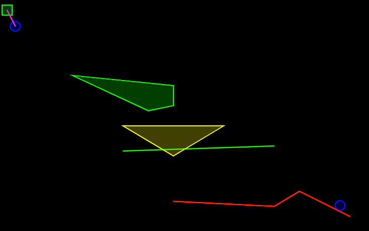

Very simple box2d debug draw



## Install

Clone this repo or download `physics-debug.lua` and copy the file in your project.

## Example

``` lua
local drawDebugPhysics = require 'physics-debug'

function love.draw()
  drawDebugPhysics(world, 0,0, 800,600)
end
```

## Run the test

```
git clone https://github.com/lzubiaur/love-physics-debug
cd love-physics-debug
love .
```
